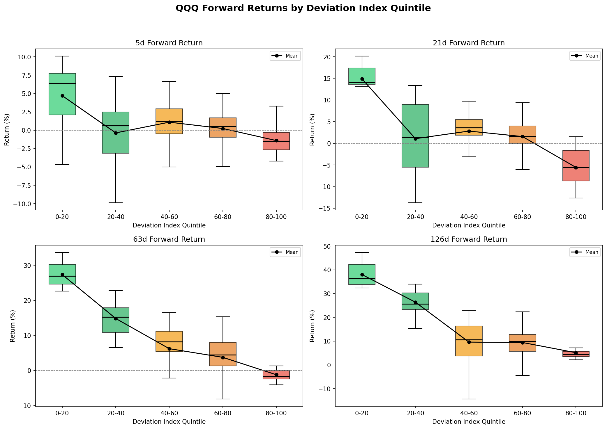

# QQQ 200-Day Moving Average Deviation Dashboard

**[Live Demo](https://yichengyang-ethan.github.io/QQQ-200D-Deviation-Dashboard/)** | Daily QQQ deviation monitoring via Yahoo Finance data


[](https://github.com/YichengYang-Ethan/QQQ-200D-Deviation-Dashboard/actions/workflows/deploy.yml)
[](https://github.com/YichengYang-Ethan/QQQ-200D-Deviation-Dashboard/actions/workflows/update-data.yml)

## Preview

<p align="center">
  
</p>

## Why This Matters

The 200-day moving average (200 DMA) is one of the most watched technical indicators:

- **When QQQ is significantly ABOVE the 200 DMA** (index > 80): Market may be overextended, historically signals potential pullback
- **When QQQ is significantly BELOW the 200 DMA** (index < 20): Market may be oversold, historically signals potential bounce

> *"Historically, when the deviation index surpasses 80, it signals a high-probability market pullback."*

## Features

- **Daily QQQ Data**: Real market data fetched via Yahoo Finance, updated daily by GitHub Actions
- **Interactive Chart**: Historical deviation with trend visualization (1Y / 2Y / All views)
- **Risk Level Indicator**: Low / Moderate / High / Danger zones
- **Stats Dashboard**: Current price, SMA, daily change
- **Demo Fallback**: If data fetch fails, falls back to simulated data with a clear "Demo Mode" indicator

## Data Pipeline

Market data is updated automatically via a GitHub Actions workflow that runs after US market close on weekdays:

1. `scripts/fetch_qqq_data.py` fetches QQQ history via `yfinance`
2. Calculates the 200-day SMA and deviation index
3. Writes `public/data/qqq.json` (included in the build as a static asset)
4. The React app fetches this JSON at runtime

## Tech Stack

- React + TypeScript (strict mode)
- Vite
- Recharts for data visualization
- GitHub Actions for data pipeline
- Deployed on GitHub Pages

## Quick Start

```bash
npm install
npm run dev
```

To generate fresh data locally:
```bash
pip install yfinance
python scripts/fetch_qqq_data.py
```

## Data Structure

```typescript
interface DataPoint {
  date: string;
  price: number;      // Current QQQ price
  sma200: number;     // 200-day simple moving average
  deviation: number;  // Raw deviation percentage
  index: number;      // Normalized 0-100 index
}
```

## Interpretation Guide

| Index Range | Risk Level | Market Condition | Historical Action |
|-------------|------------|------------------|-------------------|
| 0 - 20 | Low | Oversold | Potential buying opportunity |
| 20 - 50 | Moderate | Normal range | Hold / monitor |
| 50 - 80 | High | Extended | Reduce exposure |
| 80 - 100 | Danger | Overextended | High pullback probability |

## Statistical Analysis

**Does the deviation index predict forward QQQ returns?**

We bucketed historical deviation index values into quintiles (0-20, 20-40, ..., 80-100) and measured forward QQQ returns over multiple horizons. Results below are based on 551 trading days of data (Dec 2023 - Feb 2026).

### Forward Return Summary by Quintile

| Quintile | N | 5d Mean | 21d Mean | 63d Mean | 126d Mean |
|----------|---|---------|----------|----------|-----------|
| 0-20 (Oversold) | 11 | +4.70% | +14.91% | +27.35% | +38.03% |
| 20-40 | 36 | -0.37% | +1.07% | +14.83% | +26.39% |
| 40-60 | 147 | +1.09% | +2.83% | +6.23% | +9.60% |
| 60-80 | 338 | +0.23% | +1.56% | +3.76% | +9.43% |
| 80-100 (Extended) | 19 | -1.41% | -5.57% | -1.20% | +5.14% |

### Welch's t-test: Bottom vs Top Quintile

| Horizon | Bottom (0-20) | Top (80-100) | t-stat | p-value | Significant? |
|---------|---------------|--------------|--------|---------|--------------|
| 5-day | +4.70% | -1.41% | 4.130 | 0.0015 | Yes |
| 21-day | +14.91% | -5.57% | 14.482 | <0.0001 | Yes |
| 63-day | +27.35% | -1.20% | 24.550 | <0.0001 | Yes |
| 126-day | +38.03% | +5.14% | 19.069 | <0.0001 | Yes |

All four horizons show statistically significant differences (p < 0.05) between the bottom and top quintiles. When the deviation index is in the oversold range (0-20), forward returns are substantially higher than when the index signals an overextended market (80-100).

### Forward Return Distributions

<p align="center">
  
</p>

> Analysis script: `scripts/analyze_signals.py` -- run with `python scripts/analyze_signals.py`

## License

MIT
