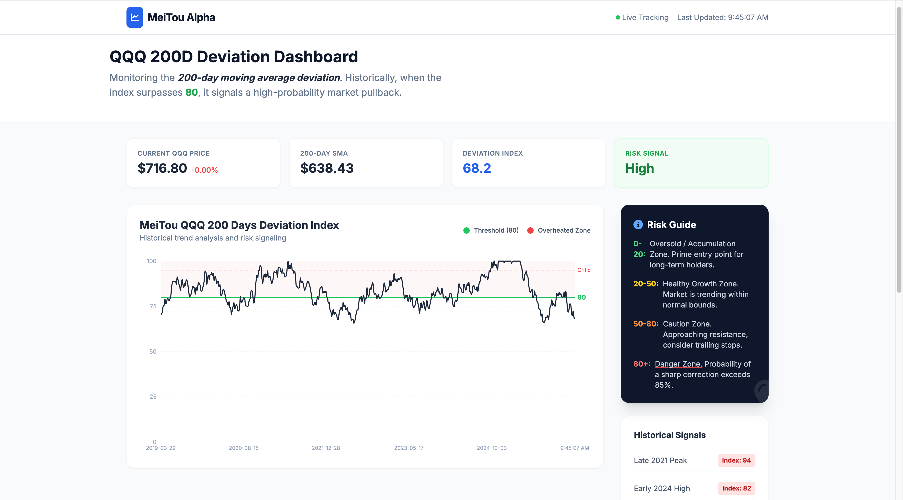

# QQQ 200-Day Moving Average Deviation Dashboard

**[Live Demo](https://yichengyang-ethan.github.io/QQQ-200D-Deviation-Dashboard/)** | Daily QQQ deviation monitoring via Yahoo Finance data

Part of a broader [quantitative finance toolkit](https://github.com/YichengYang-Ethan) built around [clawdfolio](https://github.com/YichengYang-Ethan/clawdfolio), which provides the underlying technical analysis framework (RSI, SMA/EMA, Bollinger Bands, deviation analytics).


[](https://github.com/YichengYang-Ethan/QQQ-200D-Deviation-Dashboard/actions/workflows/deploy.yml)
[](https://github.com/YichengYang-Ethan/QQQ-200D-Deviation-Dashboard/actions/workflows/update-data.yml)

## Preview

<p align="center">
  
</p>

## Why This Matters

The 200-day moving average (200 DMA) is one of the most watched technical indicators:

- **When QQQ is significantly ABOVE the 200 DMA** (index > 80): Market may be overextended, historically signals potential pullback
- **When QQQ is significantly BELOW the 200 DMA** (index < 20): Market may be oversold, historically signals potential bounce

> *"Historically, when the deviation index surpasses 80, it signals a high-probability market pullback."*

## Features

- **Daily QQQ Data**: Real market data fetched via Yahoo Finance, updated daily by GitHub Actions
- **Interactive Chart**: Historical deviation with trend visualization (1Y / 2Y / All views)
- **Risk Level Indicator**: Low / Moderate / High / Danger zones
- **Stats Dashboard**: Current price, SMA, daily change
- **Demo Fallback**: If data fetch fails, falls back to simulated data with a clear "Demo Mode" indicator

## Data Pipeline

Market data is updated automatically via a GitHub Actions workflow that runs after US market close on weekdays:

1. `scripts/fetch_qqq_data.py` fetches QQQ history via `yfinance`
2. Calculates the 200-day SMA and deviation index
3. Writes `public/data/qqq.json` (included in the build as a static asset)
4. The React app fetches this JSON at runtime

## Tech Stack

- React + TypeScript (strict mode)
- Vite
- Recharts for data visualization
- GitHub Actions for data pipeline
- Deployed on GitHub Pages

## Quick Start

```bash
npm install
npm run dev
```

To generate fresh data locally:
```bash
pip install yfinance
python scripts/fetch_qqq_data.py
```

## Data Structure

```typescript
interface DataPoint {
  date: string;
  price: number;      // Current QQQ price
  sma200: number;     // 200-day simple moving average
  deviation: number;  // Raw deviation percentage
  index: number;      // Normalized 0-100 index
}
```

## Interpretation Guide

| Index Range | Risk Level | Market Condition | Historical Action |
|-------------|------------|------------------|-------------------|
| 0 - 20 | Low | Oversold | Potential buying opportunity |
| 20 - 50 | Moderate | Normal range | Hold / monitor |
| 50 - 80 | High | Extended | Reduce exposure |
| 80 - 100 | Danger | Overextended | High pullback probability |

## Methodology Origin

The 200-day SMA deviation calculation and risk-level classification used in this dashboard follow the same methodology implemented in [clawdfolio](https://github.com/YichengYang-Ethan/clawdfolio)'s `analysis/` module (SMA, EMA, RSI, Bollinger Bands). This dashboard is a standalone React implementation focused on a single strategy, while clawdfolio provides the full-spectrum Python analytics engine.

## Related Projects

| Project | Role |
|---------|------|
| [clawdfolio](https://github.com/YichengYang-Ethan/clawdfolio) | **Methodology source** -- SMA/deviation analytics engine that this dashboard's strategy is derived from |
| [investment-dashboard](https://github.com/YichengYang-Ethan/investment-dashboard) | Sibling dashboard -- full portfolio visualization (multi-asset, multi-metric) |
| [crypto-return-prediction](https://github.com/YichengYang-Ethan/crypto-return-prediction-kaggle) | ML research -- momentum/trend prediction using similar technical indicators |
| [ESG-Driven-Stock-Value-Prediction](https://github.com/YichengYang-Ethan/ESG-Driven-Stock-Value-Prediction) | ML research -- fundamental factor analysis |

## License

MIT
