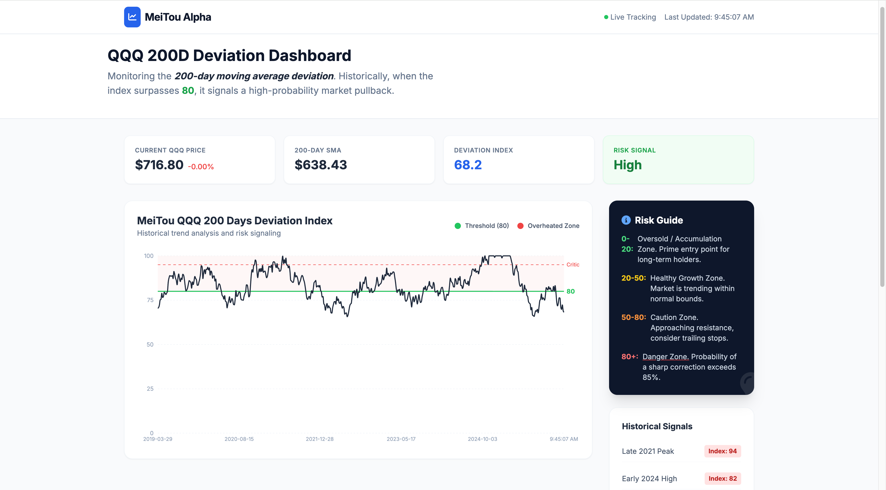

# Market Bubble Index Dashboard

[](https://github.com/yichengyang-ethan/Market-Bubble-Index-Dashboard/actions/workflows/deploy.yml)
[](https://github.com/yichengyang-ethan/Market-Bubble-Index-Dashboard/actions/workflows/update-data.yml)
[](https://github.com/YichengYang-Ethan/Market-Bubble-Index-Dashboard/actions/workflows/ci.yml)

**[Live Dashboard](https://yichengyang-ethan.github.io/Market-Bubble-Index-Dashboard/)**



A financial dashboard that quantifies market bubble risk through a **7-indicator composite index** across sentiment, liquidity, and valuation. Features a three-tab architecture, a hybrid 3-layer drawdown probability model validated via purged walk-forward CV, and two backtest strategies that beat Buy & Hold.

## Three-Tab Architecture

| Tab | Question | Key Components |
|-----|----------|----------------|
| **Bubble Temperature** | How euphoric is the market? | Bubble gauge, 7 indicator cards, history chart, backtest, signals |
| **Crash Risk** | What is the probability of a crash? | Risk gauge, probability gauges (P >10/20/30/40%), risk history, regime detection |
| **Deviation Tracker** | How far from the moving average? | Multi-ticker deviation (QQQ/SPY/TQQQ/IWM), threshold backtesting |

## Composite Index

7 indicators aggregated into a single 0–100 score via percentile-ranked weighted average:

| Indicator | Weight | Category | Signal |
|-----------|--------|----------|--------|
| QQQ Deviation | 17% | Sentiment | 200-day SMA deviation |
| VIX Level | 15% | Sentiment | Inverted — low VIX = complacency |
| CAPE Valuation | 15% | Valuation | S&P 500 price / 10-year MA |
| Tail Risk (SKEW) | 14% | Sentiment | High SKEW = complacency |
| Sector Breadth | 13% | Liquidity | Fraction of 11 sectors above 50-day SMA |
| Credit Spread | 13% | Liquidity | HYG/IEF ratio — tight spreads = risk-on |
| Yield Curve | 13% | Liquidity | 10Y-2Y spread — steepening = risk-on |

### Regime Classification

| Regime | Score | Position Mapping |
|--------|-------|-----------------|
| Low | 0–30 | Overweight +30% |
| Moderate | 30–50 | Hold Benchmark |
| Elevated | 50–70 | Underweight -20% |
| High | 70–85 | Underweight -50% |
| Extreme | 85–100 | Retain 20% Only |

## QQQ Drawdown Probability Model (v3.3)

Hybrid 3-layer model predicting the chance of significant QQQ drawdowns over the next ~9 months:

| Layer | Method | Thresholds |
|-------|--------|------------|
| 1 | Stability-selected Lasso + isotonic recalibration | 10%, 20% |
| 2 | Bayesian Beta-Binomial + PAVA monotonicity | 20%, 30% |
| 3 | EVT/GPD tail extrapolation | 40% |

**Out-of-sample validation** (purged walk-forward CV, 180-day purge):

Extending the history back to 1999 exposed the discriminative models as fragile. Across **6 ML families** (Logistic, RF, XGBoost, SVM, KNN, MLP — 100+ configs), out-of-sample AUC collapsed toward 0.5 (no edge) on the longer sample, which contains only ~8 distinct crash events. The shipped model (v4.1) therefore weights **every threshold 100% to the Bayesian Beta-Binomial layer** — calibrated drawdown probabilities (climatology) rather than discrimination. An earlier Lasso reached AUC 0.802 on the shorter 2014-2026 subsample but did not generalize. See [`RESEARCH_REPORT.md`](RESEARCH_REPORT.md) for the full model evolution and why discrimination is unreliable on a small crash sample.

## Strategy Backtesting

Two strategies that beat Buy & Hold on risk-adjusted returns over 10+ years:

| Strategy | Logic | Sharpe |
|----------|-------|--------|
| **Hysteresis Binary** | All-in when score < 24, all-out when > 84 (60-pt dead zone) | 0.70 vs B&H 0.67 |
| **Velocity Signal** | Reduce to 30% when score velocity > 15 AND score > 50 | 0.69, CAGR 18.5% |

## Quick Start

```bash
npm install && npm run dev    # Dev server on port 3000
npm run build                 # Production build
```

### Regenerate Data

```bash
pip install yfinance fredapi arch statsmodels scipy numpy pandas scikit-learn
FRED_API_KEY=your_key python scripts/fetch_bubble.py
python scripts/fetch_qqq_data.py
python scripts/fit_drawdown_model.py
```

## Tech Stack

React 19 · TypeScript · Recharts · Tailwind CSS · Vite 6 · Python 3 (yfinance, fredapi, arch, scikit-learn) · GitHub Actions

## License

MIT
